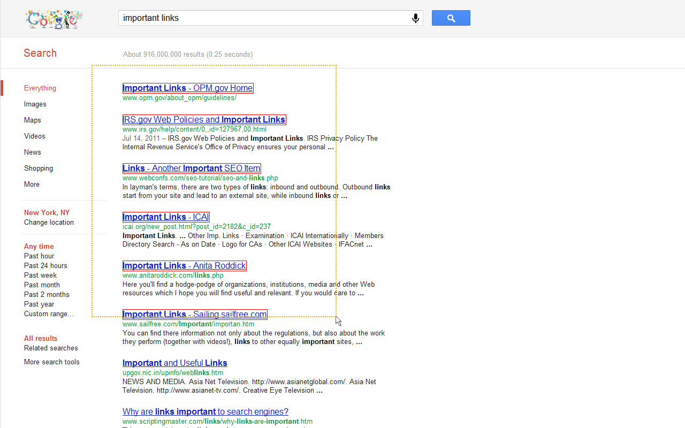

# Linkclump



## Installation

```shell
git clone https://github.com/toy/linkclump.git /path/to/where/you/want/it
```

Go to `chrome://extensions`.

Enable Developer Mode.

Click `Load unpacked` and choose the path you cloned the extension to.
